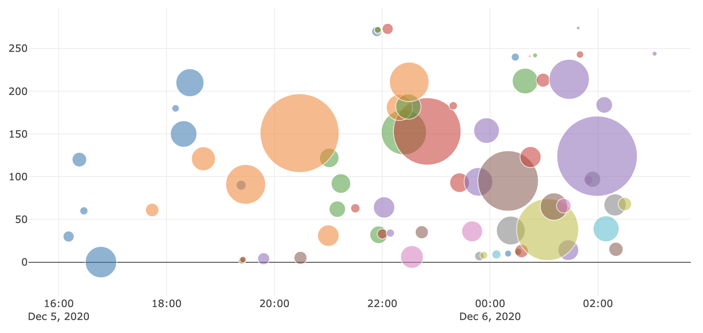

# 어뷰징 뉴스 분석 프로젝트

> 네이버 스포츠 해외축기 기사 데이터를 기반으로 뉴스기사 어뷰징 패턴을 분석합니다.

- 본 자료는 텍스트 마이닝을 활용한 연구 및 강의를 위한 목적으로 제작되었습니다.
- 본 자료를 강의 또는 연구 목적으로 활용하고자 하시는 경우 꼭 아래 메일주소로 연락주세요.
- 본 자료에 대한 <U>상업적 활용과 허가되지 않은 배포를 금지</U>합니다.
- 강의, 저작권, 출판, 특허, 공동저자에 관련해서는 문의 바랍니다.
- **Contact : ADMIN(admin@teanaps.com)**

---
## What is `Abusing`?

- 언론사가 온라인 뉴스에 대한 유저의 관심을 높이기 위해 유사한 제목이나 내용의 기사를 반복적으로 게제하는 행위

---
## Abusing Patterns...?
> 

---
## Analysis Report

### Contents
- [Introduction](./document/report-introduction.md#introduction)
- [Backgrounds](./document/report-backgrounds.md#backgrounds)
- [Method: Analysis Procedure](./document/report-method.md#method-analysis-procedure)
- [Results](./document/report-results.md#results)
- [Implications](./document/report-implications.md#implications)
- [Conclusion](./document/report-conclusion.md#conclusion)

---
## Update History
> 2020.03.08. 기본 구성 입력    
> 2021.01.17. 분석 리포트 양식 입력     

  
---

ⓒ 2021. TEANAPS all rights reserved.

